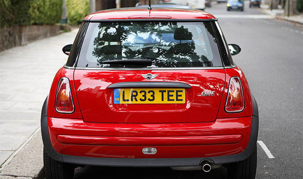
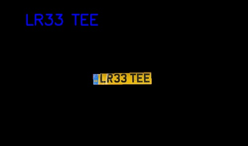
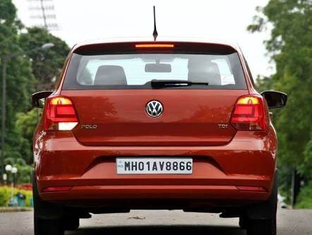
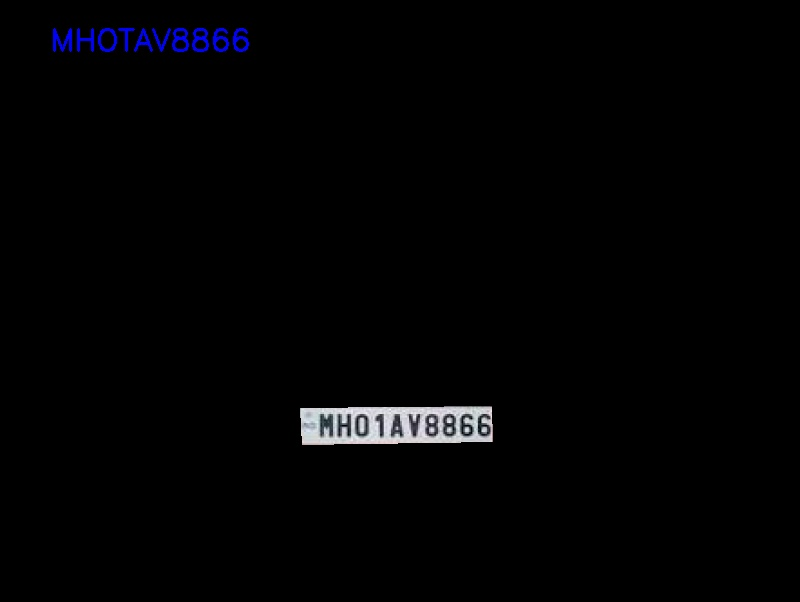
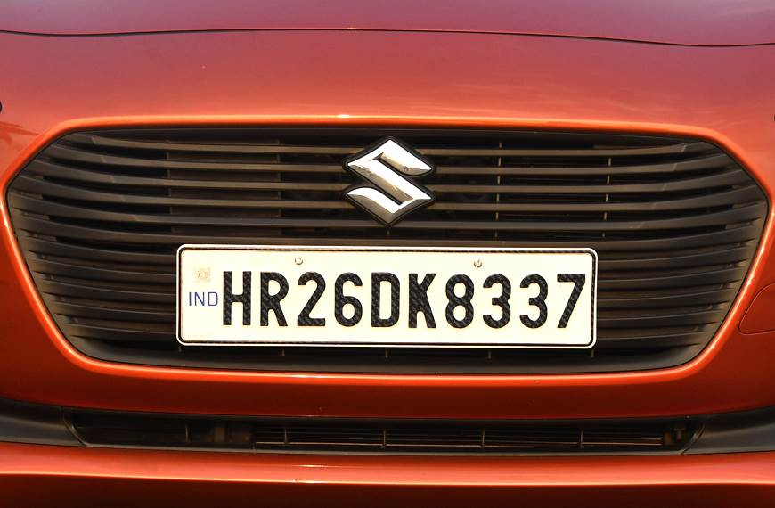
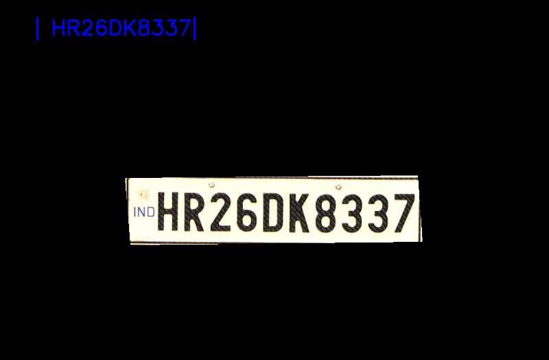

# Licence-Plate-Recognition-OpenCV

To run `NumberPlateRecognition.py` execute following command

`python NumberPlateRecognition.py --image input/<imgname.jpg> --output output/<imgname.jpg>`

# input

# output

# input

# output

# input

# output

